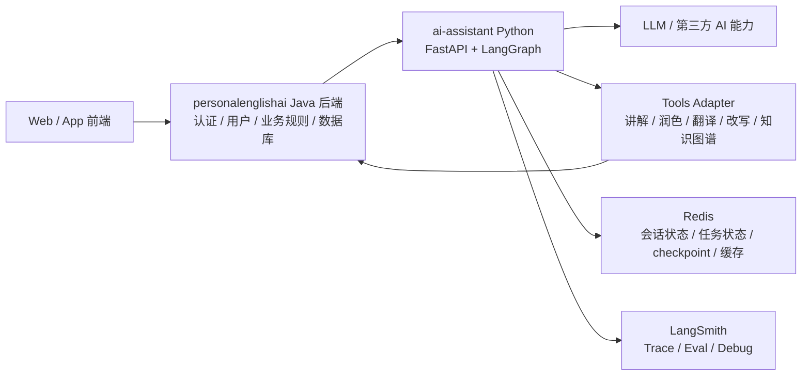
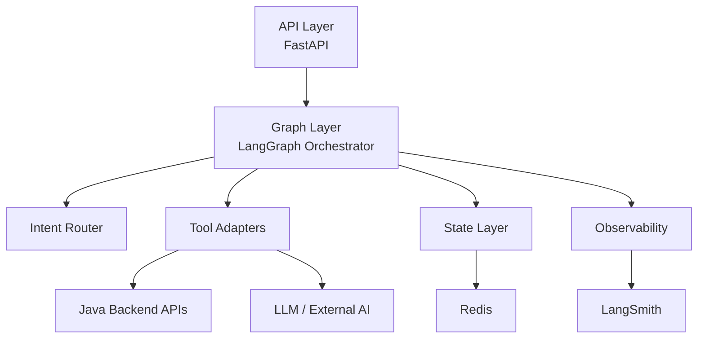
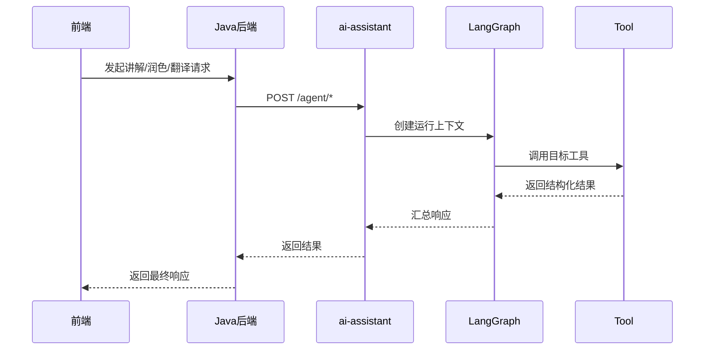
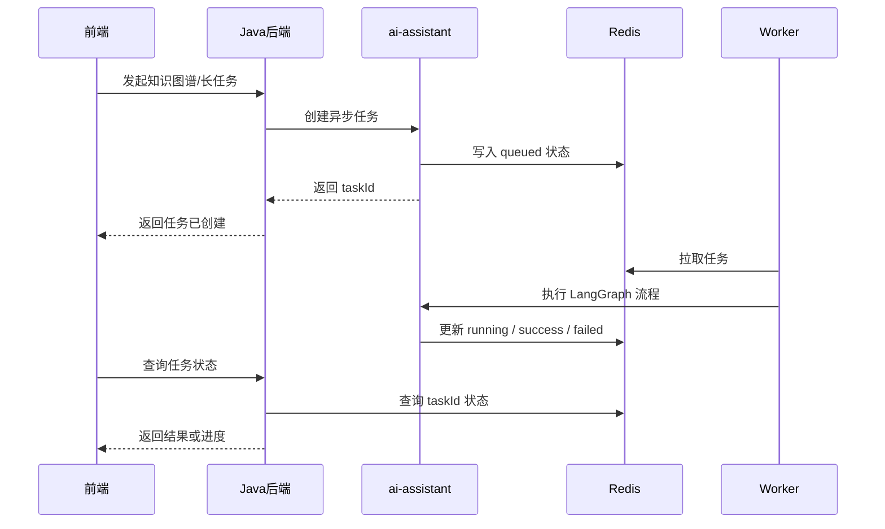
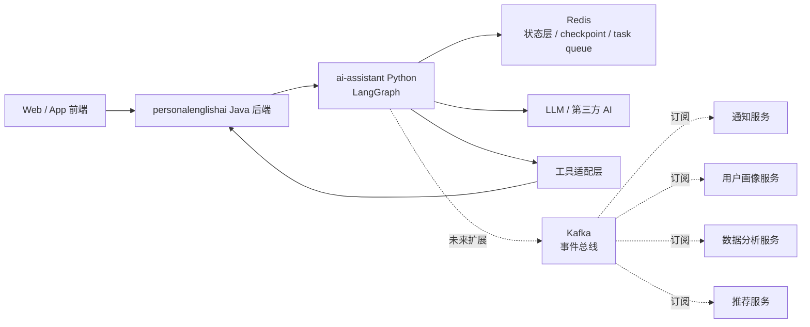
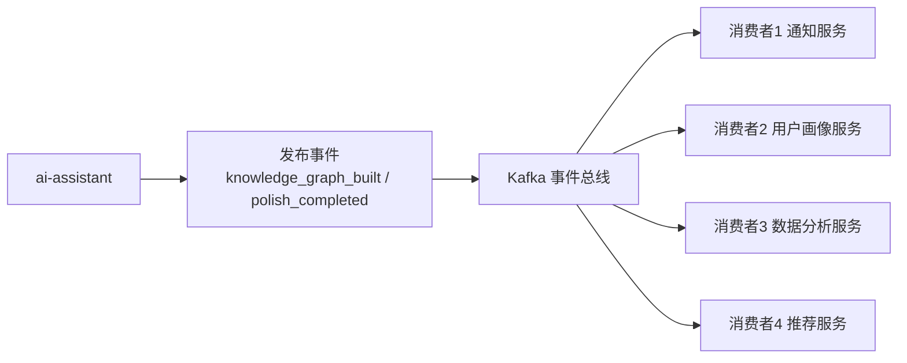

# AI Assistant Agent 编排层总体设计

## 1. 目标与边界

本项目用于在独立工程 `ai-assistant` 中建设 AI Agent 编排层，为 `personalenglishai` 提供智能增强能力，同时避免直接侵入现有 Java 后端主业务逻辑。

目标能力包括：

- 英语知识讲解
- 润色
- 翻译
- 改写
- 知识图谱构建
- 后续扩展的用户画像、推荐、分析、通知等能力

总体原则：

- 业务规则归 `Java 后端`
- 智能编排归 `Python ai-assistant`
- 两边通过稳定接口解耦
- 支持并行开发
- 先满足当前核心能力，再为未来复杂工作流预留扩展空间

---

## 2. 总体架构

### 2.1 职责划分

#### personalenglishai（Java 后端）

负责：

- 用户体系
- 权限认证
- 业务规则
- 学习数据
- 作文、背词等既有业务逻辑
- 数据库存储
- 业务事实来源

#### ai-assistant（Python 编排层）

负责：

- Agent 编排
- 工具路由
- 多步工作流控制
- 第三方 AI 库接入
- LangGraph 流程执行
- 会话状态与任务状态协调
- LangSmith 追踪与评测

### 2.2 总体架构图

### 2.3 一句话结论

`personalenglishai` 继续作为主业务后端，`ai-assistant` 作为独立 Python Agent 编排服务，通过工具接口调用业务能力，并利用 Redis 维护运行状态，利用 LangSmith 提供可观测性。

---

## 3. 当前阶段设计

### 3.1 当前阶段目标

当前阶段重点不是构建万能 Agent，而是先把一个稳定可运行的编排层打通，满足以下能力：

- 正确识别用户意图
- 正确路由到讲解 / 润色 / 翻译 / 改写等工具
- 保留必要上下文
- 返回稳定结构化结果
- 能追踪每一次调用过程

### 3.2 当前阶段核心技术栈

- `Python`
- `FastAPI`
- `LangChain`
- `LangGraph`
- `LangSmith`
- `Redis`

### 3.3 ai-assistant 内部模块图

### 3.4 当前阶段模块职责

#### 1) API 接入层

对外提供同步 REST 接口，例如：

- `POST /agent/chat`
- `POST /agent/explain`
- `POST /agent/polish`
- `POST /agent/translate`
- `POST /agent/rewrite`

职责：

- 接收 Java 后端请求
- 参数校验
- 调用编排层
- 返回结构化结果

#### 2) Agent 编排层

以 `LangGraph` 为核心。

职责：

- 判断用户意图
- 选择工具
- 组合上下文
- 执行单步或多步流程
- 统一错误处理与降级

#### 3) Tools Adapter 层

将 `personalenglishai` 已有能力或外部能力包装成工具。

建议工具示例：

- `explain_english_knowledge`
- `polish_text`
- `translate_text`
- `rewrite_text`
- `build_knowledge_graph`

要求：

- 输入输出结构稳定
- Agent 不直接访问数据库
- Agent 不直接耦合业务细节

#### 4) 状态层

使用 `Redis`。

职责：

- `conversation state`
- `task status`
- `LangGraph checkpoint`
- 短期上下文缓存
- 幂等控制
- 轻量异步协调

#### 5) 观测层

使用 `LangSmith`。

职责：

- Trace 每次 Agent 运行
- 记录 prompt / tool / latency / error
- 支持后续评测和回归分析

---

## 4. 当前阶段交互方式

当前阶段采用“双通道设计”，但先落地同步，再补异步。

### 4.1 同步通道

适用场景：

- 英语知识讲解
- 短文本润色
- 短文本翻译
- 简单改写
- 快速问答

同步调用时序图：

### 4.2 异步通道

适用场景：

- 知识图谱构建
- 长作文分析
- 多步复杂工作流
- 批量任务
- 需要重试和恢复的任务

异步任务时序图：

---

## 5. Redis 与 Kafka 的职责边界

### 5.1 Redis 放在哪里、做什么

Redis 放在 `ai-assistant` 内核旁边，主要服务编排层和 worker。

职责：

- 会话状态
- 任务状态
- checkpoint
- 缓存
- 幂等控制
- 轻量队列

一句话：

`Redis 解决 Agent 任务怎么跑、跑到哪、能不能恢复。`

### 5.2 Kafka 未来放在哪里、做什么

Kafka 不是当前阶段必选项，而是未来扩展项。

适合引入 Kafka 的场景：

- 一个事件需要被多个独立模块消费
- 需要长期保留事件流
- 需要跨多个服务解耦
- 需要通知、画像、分析、推荐等模块订阅同类事件

典型事件：

- `polish_completed`
- `translation_completed`
- `rewrite_completed`
- `knowledge_graph_built`
- `agent_run_failed`

一句话：

`Kafka 解决系统里发生了什么，以及谁需要知道。`

### 5.3 Redis 与 Kafka 的位置图

---

## 6. 未来阶段设计

未来阶段目标：从“能跑”进化到“可恢复、可广播、可持续优化”。

### 6.1 异步任务体系增强

未来补充：

- worker 进程池
- 标准任务模型
- 重试机制
- 超时机制
- 失败恢复
- 死信或失败记录

建议统一任务字段：

- `task_id`
- `run_id`
- `trace_id`
- `conversation_id`
- `status`
- `task_type`
- `payload`
- `result`
- `error`
- `created_at`
- `updated_at`

### 6.2 事件驱动扩展

未来按需增加 Kafka 后，可逐步增加以下消费者能力：

#### 通知服务

用途：

- 任务完成通知
- 失败提醒
- 异步结果推送

#### 用户画像服务

用途：

- 汇总用户长期错误类型
- 生成学习能力画像
- 形成个性化学习视图

#### 数据分析服务

用途：

- 统计功能调用量、成功率、耗时
- 识别高价值功能与失败热点
- 为产品优化提供依据

#### 推荐服务

用途：

- 根据用户薄弱点推荐练习
- 根据知识图谱推荐学习内容
- 根据写作和翻译结果推荐后续动作

### 6.3 未来事件驱动图

---

## 7. 分阶段演进路线

### Phase 1：最小可运行版本

先完成：

- FastAPI 服务骨架
- LangGraph 编排主链路
- Redis 状态层
- LangSmith trace
- `explain / polish / translate / rewrite` 基础工具接口
- Java 后端到 `ai-assistant` 的同步 REST 调用

### Phase 2：异步能力增强

补充：

- task worker
- 异步任务状态管理
- 长任务支持
- 知识图谱构建异步化
- 重试与恢复

### Phase 3：事件驱动扩展

按需补充：

- Kafka
- 事件模型
- 通知服务
- 用户画像服务
- 分析服务
- 推荐服务

---

## 8. 当前结论

本项目建议采用以下主方针：

- `personalenglishai` 继续作为主业务后端
- `ai-assistant` 作为独立 Python Agent 编排服务
- 当前阶段核心技术栈：`FastAPI + LangGraph + LangSmith + Redis`
- 当前先落地同步 REST
- 同时预留异步任务模型
- Kafka 作为未来事件驱动扩展能力，而不是第一阶段必选项

一句话总结：

`先用 Python 独立编排层为 Java 业务赋能，先把同步与状态层跑顺，再逐步扩展异步任务和事件驱动能力。`
