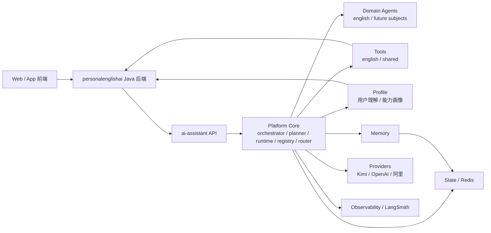
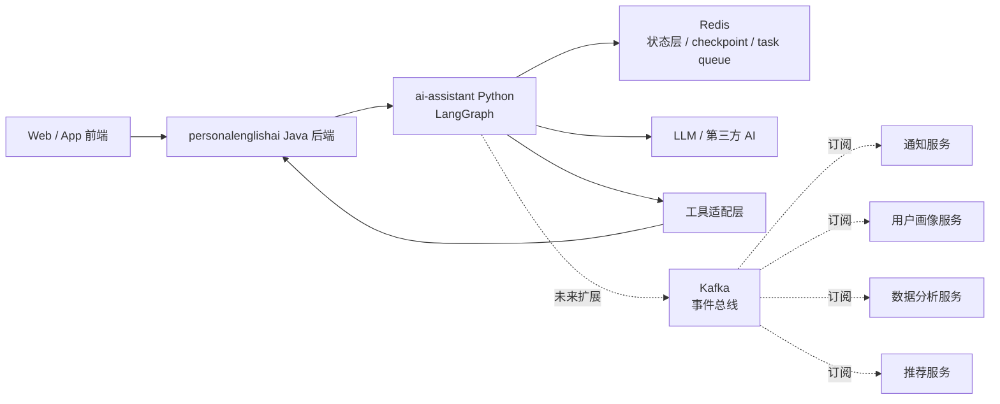
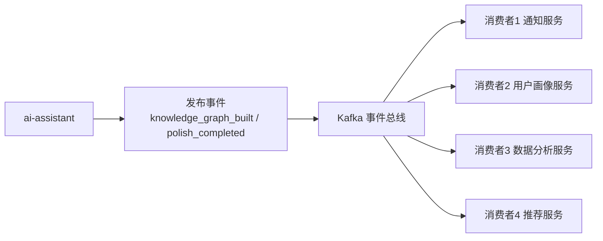

# AI Assistant 领域型 Agent 平台总体设计

## 1. 项目定位

`ai-assistant` 不再仅仅定义为一个英语问答助手，而是定义为：

`一个以英语学科为起点、后续可扩展到其他学科的领域型 Agent 平台`

它的职责不是简单返回一次回答，而是围绕学习场景持续完成：

- 用户问题理解
- 能力调用与工作流编排
- 用户学习特征提取
- 用户能力画像更新
- 多轮对话记忆与状态管理
- 后续跨学科扩展

---

## 2. 总体边界

### 2.1 Java 后端 `personalenglishai`

继续负责：

- 用户体系
- 权限认证
- 学习业务规则
- 作文、背词等既有业务能力
- 数据库存储
- 业务事实来源

### 2.2 Python 平台 `ai-assistant`

负责：

- Agent 平台内核
- 模型 Provider 接入
- 工具注册与调用
- 领域 Agent 编排
- 用户理解与能力画像
- 记忆与运行状态管理
- LangSmith 追踪与评测

结论：

`Java 负责业务主系统，Python 负责智能平台层。`

---

## 3. 平台目标

### 3.1 当前目标

先完成一个可运行的平台最小内核，用于承载英语领域 Agent。

### 3.2 中期目标

形成“英语学习型 Agent 平台”闭环，支持讲解、润色、翻译、改写、能力画像更新等核心场景。

### 3.3 长期目标

在平台内核稳定后，将同一套平台能力扩展到其他学科。

---

## 4. 总体架构



一句话概括：

`ai-assistant` 是一个平台内核，英语只是第一个落地领域。

---

## 5. 目标目录结构

```text
app/
├─ api/                    # FastAPI 路由
├─ core/                   # 配置、依赖注入、基础常量
├─ platform/               # 平台内核
│  ├─ orchestrator/        # 编排执行
│  ├─ planner/             # 任务拆解与计划
│  ├─ registry/            # agent/tool/provider 注册中心
│  ├─ router/              # 意图与流程路由
│  └─ runtime/             # 运行上下文、trace、checkpoint
├─ agents/                 # 领域 agent
│  ├─ english/             # 英语领域 agent
│  └─ shared/              # 通用 agent 能力
├─ tools/                  # 工具集合
│  ├─ english/             # 讲解/翻译/润色/改写/知识图谱
│  └─ shared/              # 通用工具
├─ providers/              # 模型供应方适配层
├─ profile/                # 用户理解与能力画像
│  ├─ extractor/           # 从对话和行为提取信号
│  ├─ evaluator/           # 评估用户能力
│  ├─ updater/             # 更新用户画像
│  └─ models.py            # 画像数据结构
├─ memory/                 # 会话记忆、长期记忆、学习记忆
├─ state/                  # Redis / task state / queue state
├─ integrations/           # Java 后端与第三方系统
├─ observability/          # LangSmith / logging / eval
├─ schemas/                # 输入输出模型
└─ services/               # 平台外围服务封装
```

说明：

- `platform/` 是平台共性能力，不带英语领域语义
- `agents/english/` 是英语领域入口
- `tools/english/` 放英语能力工具
- `profile/` 单独承载用户理解与能力画像，不混入普通聊天逻辑
- `memory/` 与 `state/` 分离，前者偏语义记忆，后者偏运行态

---

## 6. 三大核心主线

### 6.1 Agent 编排主线

职责：

- 接收请求
- 决定走哪个 Agent / Tool / Workflow
- 控制执行顺序
- 汇总输出

核心模块：

- `platform/orchestrator`
- `platform/router`
- `platform/runtime`

### 6.2 Tool 能力主线

职责：

- 封装英语讲解、翻译、润色、改写、知识图谱等能力
- 接入 Java 后端或第三方服务
- 保证输入输出稳定

核心模块：

- `tools/english`
- `tools/shared`
- `integrations`

### 6.3 用户理解主线

职责：

- 识别用户当前水平、偏好、目标
- 提取对话中的学习信号
- 更新能力画像
- 为后续回答提供个性化上下文

核心模块：

- `profile/extractor`
- `profile/evaluator`
- `profile/updater`
- `memory`

---

## 7. 分阶段实施策略

采用“终局按平台设计，落地按阶段推进”的方式。

### Phase 1：平台最小内核

目标：

- 跑通统一 assistant
- 接入默认模型 Provider
- 建立平台注册、运行、状态和观测基础

范围：

- `providers`
- `services`
- `platform/runtime`
- `platform/registry`
- `state`
- `observability`
- `POST /assistant/chat`

当前阶段优先默认接入：

- `Kimi`

### Phase 2：英语领域能力闭环

目标：

- 将英语能力正式挂到平台内核上
- 形成第一个领域闭环

范围：

- `agents/english`
- `tools/english`
- explain / translate / polish / rewrite
- 基础路由
- 英语领域上下文组织

### Phase 3：用户理解与能力画像

目标：

- 让平台能“理解用户是谁、当前水平如何、薄弱点在哪”

范围：

- `profile/models.py`
- `profile/extractor`
- `profile/evaluator`
- `profile/updater`
- `memory`

输出示例：

- 学习目标
- 词汇水平
- 语法薄弱点
- 写作问题模式
- 偏好讲解风格

### Phase 4：复杂工作流与平台增强

目标：

- 支持真正的平台式多步任务与长流程

范围：

- `platform/orchestrator`
- `platform/planner`
- 异步任务
- 知识图谱构建链
- 长作文分析链
- 多学科扩展能力

---

## 8. 当前代码迁移策略

当前仓库已经存在：

- `api`
- `core`
- `providers`
- `services`
- `state`
- `tools`
- `observability`
- `integrations`

迁移原则：

1. 先补平台骨架目录，不立即大范围搬迁现有实现
2. 先保持现有运行链路稳定
3. 后续按 Phase 逐步把逻辑迁移到新目录
4. 避免“目录先重构完、功能全断掉”

因此，当前应理解为：

- 现有代码已是平台早期内核
- 新目录是未来结构
- 迁移会分阶段完成，而不是一次性重写

---

## 9. 结论

本项目应按“领域型 Agent 平台”建设，而不是按“单个英语助手”建设。

具体策略是：

- 终局结构采用平台化设计
- 当前落地采用分阶段推进
- 先跑通平台最小内核
- 再接英语领域能力
- 再接用户理解与能力画像
- 最后扩到复杂工作流和其他学科

Redis 放在 `ai-assistant` 内核旁边，主要服务编排层和 worker。

职责：

- 会话状态
- 任务状态
- checkpoint
- 缓存
- 幂等控制
- 轻量队列

一句话：

`Redis 解决 Agent 任务怎么跑、跑到哪、能不能恢复。`

### 5.2 Kafka 未来放在哪里、做什么

Kafka 不是当前阶段必选项，而是未来扩展项。

适合引入 Kafka 的场景：

- 一个事件需要被多个独立模块消费
- 需要长期保留事件流
- 需要跨多个服务解耦
- 需要通知、画像、分析、推荐等模块订阅同类事件

典型事件：

- `polish_completed`
- `translation_completed`
- `rewrite_completed`
- `knowledge_graph_built`
- `agent_run_failed`

一句话：

`Kafka 解决系统里发生了什么，以及谁需要知道。`

### 5.3 Redis 与 Kafka 的位置图



---

## 6. 未来阶段设计

未来阶段目标：从“能跑”进化到“可恢复、可广播、可持续优化”。

### 6.1 异步任务体系增强

未来补充：

- worker 进程池
- 标准任务模型
- 重试机制
- 超时机制
- 失败恢复
- 死信或失败记录

建议统一任务字段：

- `task_id`
- `run_id`
- `trace_id`
- `conversation_id`
- `status`
- `task_type`
- `payload`
- `result`
- `error`
- `created_at`
- `updated_at`

### 6.2 事件驱动扩展

未来按需增加 Kafka 后，可逐步增加以下消费者能力：

#### 通知服务

用途：

- 任务完成通知
- 失败提醒
- 异步结果推送

#### 用户画像服务

用途：

- 汇总用户长期错误类型
- 生成学习能力画像
- 形成个性化学习视图

#### 数据分析服务

用途：

- 统计功能调用量、成功率、耗时
- 识别高价值功能与失败热点
- 为产品优化提供依据

#### 推荐服务

用途：

- 根据用户薄弱点推荐练习
- 根据知识图谱推荐学习内容
- 根据写作和翻译结果推荐后续动作

### 6.3 未来事件驱动图



---

## 7. 分阶段演进路线

### Phase 1：最小可运行版本

先完成：

- FastAPI 服务骨架
- LangGraph 编排主链路
- Redis 状态层
- LangSmith trace
- `explain / polish / translate / rewrite` 基础工具接口
- Java 后端到 `ai-assistant` 的同步 REST 调用

### Phase 2：异步能力增强

补充：

- task worker
- 异步任务状态管理
- 长任务支持
- 知识图谱构建异步化
- 重试与恢复

### Phase 3：事件驱动扩展

按需补充：

- Kafka
- 事件模型
- 通知服务
- 用户画像服务
- 分析服务
- 推荐服务

---

## 8. 当前结论

本项目建议采用以下主方针：

- `personalenglishai` 继续作为主业务后端
- `ai-assistant` 作为独立 Python Agent 编排服务
- 当前阶段核心技术栈：`FastAPI + LangGraph + LangSmith + Redis`
- 当前先落地同步 REST
- 同时预留异步任务模型
- Kafka 作为未来事件驱动扩展能力，而不是第一阶段必选项

一句话总结：

`先用 Python 独立编排层为 Java 业务赋能，先把同步与状态层跑顺，再逐步扩展异步任务和事件驱动能力。`
