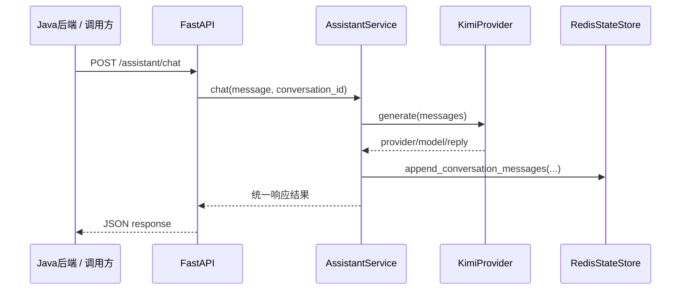

# Assistant Provider Design

**Goal:** 为 `ai-assistant` 落地第一版可用 assistant，先默认接入 `Kimi`，同时保留未来新增 provider 的扩展能力。

## Scope

当前阶段只做统一聊天 assistant，不做多 tool 路由，不做多 agent 协作，不做复杂 LangGraph 编排。

第一版完成后应具备：

- 一个统一聊天入口
- 一个默认可运行的 `Kimi` provider
- 可插拔 provider 抽象
- 统一的请求与响应模型
- Redis 状态写入与 LangSmith 元数据保持兼容

## Architecture

本轮设计采用三层：

1. `API`
   - 新增 `POST /assistant/chat`
   - 接收消息并返回统一响应
2. `Assistant Service`
   - 负责组织消息、调用 provider、写入状态
   - 不承载业务规则
3. `Provider Adapter`
   - 定义统一协议
   - 第一版实现 `Kimi`
   - 后续 `OpenAI / 阿里` 通过新增适配器接入

## Provider Strategy

第一版默认 provider 固定为 `kimi`，但代码结构不写死厂商：

- `base.py` 定义 provider 协议和统一结果
- `kimi.py` 实现 `Kimi` 对话调用
- `registry.py` 根据配置返回默认 provider

`Kimi` 采用 OpenAI-compatible chat completions 调用方式，配置项包含：

- `AI_ASSISTANT_DEFAULT_PROVIDER`
- `AI_ASSISTANT_KIMI_API_KEY`
- `AI_ASSISTANT_KIMI_BASE_URL`
- `AI_ASSISTANT_KIMI_MODEL`

## Request Flow

## Data Contract

请求：

- `message`
- 可选 `conversation_id`

响应：

- `reply`
- `provider`
- `model`
- `processor`
- `trace_id`
- `tracing`
- `state`

## Non-Goals

本轮明确不做：

- 多 provider 同时切换
- tool routing
- explain / translate / polish / rewrite 能力拆分
- 异步任务
- supervisor / multi-agent

## Testing

本轮测试重点：

- provider registry 能返回默认 `kimi`
- `KimiProvider` 能正确解析兼容接口响应
- `AssistantService` 能调用 provider 并写入状态
- `/assistant/chat` 路由返回统一结构
