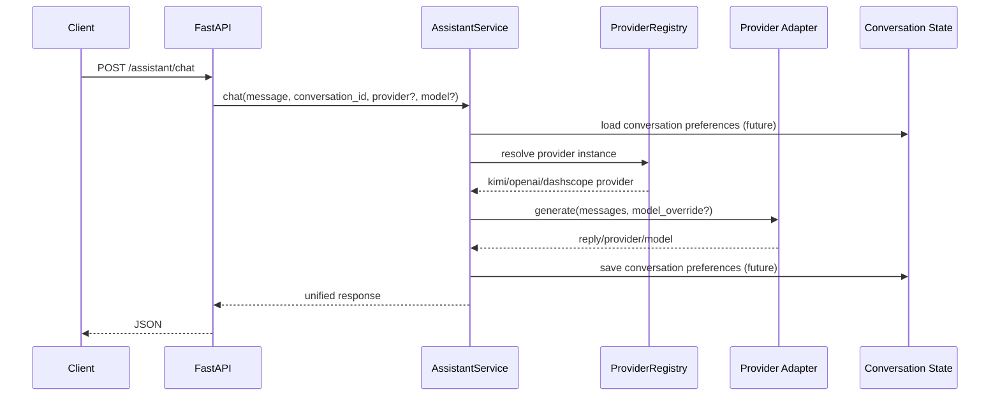

# Multi-Provider Session Model Design

**Goal:** 为 `ai-assistant` 增加 `OpenAI / Kimi / DashScope` 多 provider 支持，并为“同一会话内切换模型并持续沿用”预留协议与状态结构。

## Scope

本轮设计解决两个问题：

- provider 不再只支持 `kimi`
- 会话后续要支持“切一次模型，后续消息默认沿用”

当前阶段先完成后端基础设施，不做前端 UI，不做真实会话模型偏好持久化实现，只把接口和代码结构预留好。

## Architecture

本轮采用四层：

1. `API`
   - `POST /assistant/chat`
   - 请求体允许可选 `provider` 和 `model`
2. `AssistantService`
   - 接收消息和会话参数
   - 解析本次请求使用的 provider / model
   - 当前先支持“请求级覆盖”
   - 后续再接会话级偏好存储
3. `Provider Registry`
   - 根据 provider 名称返回对应 provider 实例
   - 支持默认 provider 和显式 provider
4. `OpenAI-Compatible Provider Layer`
   - 抽公共 HTTP 调用逻辑
   - `Kimi / OpenAI / DashScope` 只保留厂商配置差异

## Provider Strategy

这三家当前都走 OpenAI-compatible `chat/completions` 协议，因此不应写三份重复 HTTP 调用代码。

设计拆分如下：

- `base.py`
  - 保留 `ChatProvider` 协议
  - 保留统一 `ProviderResponse`
- `openai_compatible.py`
  - 负责：
    - 统一请求地址拼接
    - Bearer 鉴权
    - timeout
    - 响应解析
    - 兼容 `content: string | list`
- `kimi.py`
  - 继承公共基类
  - provider 名为 `kimi`
- `openai.py`
  - 继承公共基类
  - provider 名为 `openai`
- `dashscope.py`
  - 继承公共基类
  - provider 名为 `dashscope`

## Session Model Switching

产品语义定为：

- 用户在一个 `conversation_id` 中选定一次模型
- 后续消息默认沿用
- 用户再次切换时，覆盖旧选择

为了让后端以后无缝支持这个能力，本轮先把协议设计成：

请求字段：

- `message`
- `conversation_id`
- 可选 `provider`
- 可选 `model`

当前实现语义：

- 如果请求里显式传了 `provider/model`，本次请求按它执行
- 如果未传，使用系统默认 provider 及其默认 model

后续扩展语义：

- 先从 conversation state 中查当前会话的 `provider/model`
- 请求未显式传值时，沿用会话值
- 请求显式传值时，更新会话值

## Data Flow

## Configuration

当前配置保留三套 provider 参数：

- `AI_ASSISTANT_DEFAULT_PROVIDER`
- `AI_ASSISTANT_OPENAI_API_KEY`
- `AI_ASSISTANT_OPENAI_BASE_URL`
- `AI_ASSISTANT_OPENAI_MODEL`
- `AI_ASSISTANT_OPENAI_TIMEOUT_SECONDS`
- `AI_ASSISTANT_KIMI_API_KEY`
- `AI_ASSISTANT_KIMI_BASE_URL`
- `AI_ASSISTANT_KIMI_MODEL`
- `AI_ASSISTANT_KIMI_TIMEOUT_SECONDS`
- `AI_ASSISTANT_DASHSCOPE_API_KEY`
- `AI_ASSISTANT_DASHSCOPE_BASE_URL`
- `AI_ASSISTANT_DASHSCOPE_MODEL`
- `AI_ASSISTANT_DASHSCOPE_TIMEOUT_SECONDS`

## Error Handling

本轮至少要把 provider 侧异常分成三类：

- 配置错误：缺 key / provider 不支持
- 上游超时：返回可识别错误，不再直接裸 `500`
- 上游 HTTP 错误：保留状态码和摘要信息

当前阶段不做复杂错误码体系，但要避免所有外部错误都变成笼统 `500`。

## Testing

本轮测试重点：

- registry 能返回 `kimi / openai / dashscope`
- 三个 provider 都复用同一公共 HTTP 逻辑
- 显式传入 `provider/model` 时，assistant service 使用覆盖值
- 不传 `provider/model` 时，assistant service 使用默认配置
- `/assistant/chat` 请求体支持可选 `provider/model`

## Non-Goals

本轮明确不做：

- 前端模型切换 UI
- conversation preference 真正持久化到 Redis
- 多 provider 回退链路
- 多模型并发路由
- 多 agent 协同
