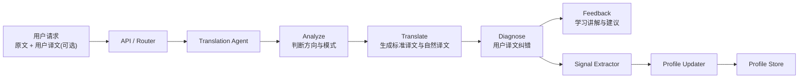

# Translation Agent With Profile Signals Design

**Goal:** 为 `ai-assistant` 增加第一版 `translation agent`，同时把翻译纠错过程中的用户信号结构化并写入用户画像。

## Scope

本轮只做翻译场景，不扩展到润色、写作、单词。

第一版覆盖：

- 中译英 / 英译中
- 用户只提交原文时，返回系统翻译结果
- 用户同时提交“原文 + 自己的译文”时，返回纠错诊断
- 从纠错结果中提取画像信号
- 将画像信号写入用户画像存储

本轮不做：

- 多语言翻译
- 多 agent 协作
- 复杂推荐系统
- 全量能力评分体系

## Product Positioning

翻译功能不应只是“通用大模型翻译接口”，而应是“面向学生学习的教学型翻译 agent”。

因此第一版输出目标不是单一译文，而是：

- `standard_translation`
- `natural_translation`
- `diagnosis`
- `learning_feedback`

如果用户提交了自己的译文，系统还需要输出：

- 哪些地方错了
- 错误属于什么类型
- 为什么错
- 如何改正

## Architecture

整体采用单 agent workflow，而不是多 agent 协作。

## Request Modes

第一版支持两种模式：

### 1. Translation Mode

用户只提供原文：

- `source_text`
- `direction`

系统返回：

- 标准译文
- 自然译文
- 简短知识点

### 2. Diagnosis Mode

用户提供原文和自己的译文：

- `source_text`
- `user_translation`
- `direction`

系统返回：

- 标准译文
- 自然译文
- 用户译文的错误诊断
- 学习建议
- 画像更新摘要

## Error Taxonomy

第一版纠错只关注 4 类问题：

- `grammar_error`
- `word_choice_issue`
- `unnatural_expression`
- `missing_or_mistranslated_content`

这是当前最稳的范围，足以支撑基础画像，又不会把 schema 做得过重。

## Profile Signals

本轮只提取翻译相关画像，不做全局学习画像。

结构化信号包括：

- `translation_direction_preference`
- `frequent_error_types`
- `grammar_weak_points`
- `lexical_weak_points`
- `literal_translation_tendency`

说明：

- `translation_direction_preference`
  - 当前用户更常做中译英还是英译中
- `frequent_error_types`
  - 最近一段时间高频错误分布
- `grammar_weak_points`
  - 如时态、冠词、单复数、语序
- `lexical_weak_points`
  - 如搭配不当、词义选择偏差
- `literal_translation_tendency`
  - 是否明显存在中文直译英文的倾向

## Data Model Direction

第一版建议拆成三类结构：

### 1. User-facing translation result

给前端直接展示：

- `standard_translation`
- `natural_translation`
- `diagnosis_items`
- `learning_feedback`

### 2. Structured diagnosis signals

给系统内部使用：

- `error_types`
- `weak_points`
- `literal_translation_tendency`
- `confidence`

### 3. Profile snapshot / delta

给画像存储层使用：

- `profile_delta`
- `updated_translation_stats`
- `updated_weak_points`

## Storage Strategy

第一版先走当前项目已有状态层。

- 会话状态：继续使用 RedisStateStore
- 画像存储：先扩展当前 state/profile 层，使用 Redis 或轻量 JSON 结构

关键原则：

- “一次翻译结果”与“长期画像”分开存
- 画像更新采用增量方式，不覆盖整个用户画像

## Agent Boundary

`translation agent` 负责：

- 翻译
- 纠错
- 学习反馈
- 产出结构化信号

`profile updater` 负责：

- 接收结构化信号
- 更新用户画像
- 返回更新摘要

也就是说：

- agent 不直接操纵画像内部统计逻辑
- profile updater 不负责翻译和诊断

## Main Difference From Generic LLM Translation

差异化不在“翻得更像大模型”，而在：

- 更适合学生
- 更重视纠错与解释
- 能积累长期画像
- 后续能反哺个性化输出

因此本功能本质上是：

`翻译 + 诊断 + 画像更新`

而不是简单的：

`输入文本 -> 输出译文`

## Testing

第一版测试重点：

- translation request schema 可区分普通翻译与纠错模式
- translation agent 能返回结构化翻译结果
- diagnosis extractor 能稳定输出 4 类错误标签
- profile updater 能写入翻译画像信号
- 同一用户多次翻译后，画像统计会累积

## Future Extension

后续可以平滑扩展到：

- `polish agent`
- `writing agent`
- `vocabulary agent`

并复用：

- signal extractor
- profile updater
- profile store
- session memory
