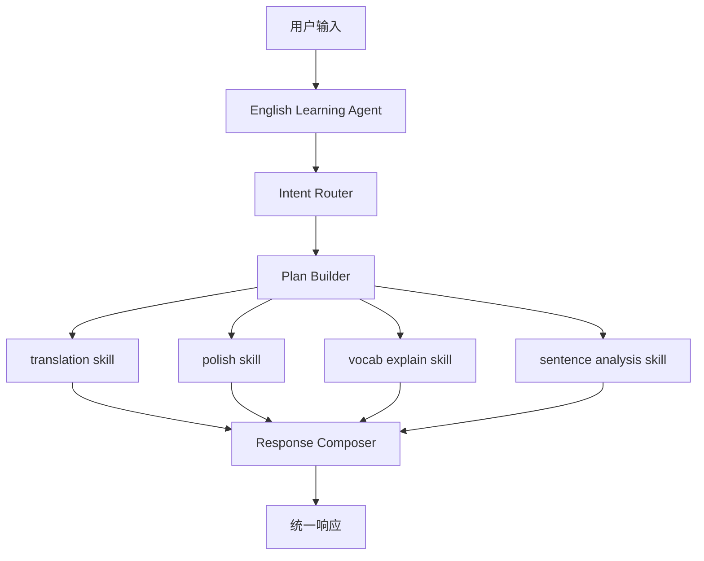

# English Learning Agent 设计稿

## 目标

当前平台先收敛为一个面向英语学习场景的上层 agent，而不是并排拆成多个功能型 agent。

第一阶段的目标是建立一套稳定、可扩展、可测试的基础结构，使系统能够：

- 自动识别用户输入中的英语学习意图
- 支持一句话中同时包含多个意图
- 按顺序调用多个 skill
- 将多个 skill 的结果整合为一次统一回复
- 为未来接入用户画像保留明确接口，但暂不引入复杂画像逻辑

## 为什么不采用多 agent 并列

当前功能范围主要包括：

- 翻译
- 润色
- 单词讲解
- 句子分析

这些能力虽然在业务上不同，但在工程上还不具备足够强的独立自治性。它们目前共同具备以下特征：

- 输入边界清晰
- 输出边界清晰
- 本质上主要是单轮模型调用
- 不需要独立规划复杂多步执行
- 不需要独立维护目标或长期状态

因此，如果现在把它们都做成独立 agent，会带来不必要的复杂度：

- 需要维护多套 agent 边界
- 需要维护多套 prompt 生命周期
- 需要维护多套编排入口
- 后续很容易因为功能不够复杂而再次合并

这属于典型的过度 agent 化设计。

## 推荐方案

采用一个上层 `English Learning Agent`，下挂多个英语学习 skill。

### 上层 agent 负责

- 理解用户请求
- 识别一个或多个意图
- 生成 skill 执行计划
- 决定 skill 调用顺序
- 将多个结果整合成统一回复
- 预留画像读取和写入的接入点

### 下层 skill 负责

- 在明确输入下完成单点能力
- 返回稳定结构化结果
- 不负责上层任务编排

## 第一阶段 skill 范围

第一阶段先建设四个核心 skill：

- `translation`
- `polish`
- `vocab_explain`
- `sentence_analysis`

它们统一由上层 `English Learning Agent` 调用。

## 总体架构



## 请求处理流程

### 单意图场景

例如：

> 请帮我把这句话翻译成英文。

处理流程：

1. agent 识别主意图为 `translation`
2. 生成只包含一个 skill 的执行计划
3. 调用 `translation skill`
4. 将结果直接整理后返回

### 多意图场景

例如：

> 帮我翻译这句话，并顺便解释一下这里为什么用现在完成时。

处理流程：

1. agent 识别两个意图
2. 生成执行计划：
   - `translation`
   - `sentence_analysis`
3. 按顺序调用 skill
4. 将两个 skill 的结果统一合成为一次回复

## 模块职责

### `English Learning Agent`

建议拆成四个核心模块：

- `english_learning_agent.py`
- `intent_router.py`
- `plan_builder.py`
- `response_composer.py`

职责如下：

#### `intent_router`

负责识别用户输入中的意图集合，例如：

- 仅翻译
- 翻译 + 语法分析
- 单词讲解 + 句子分析

第一阶段建议优先使用 LLM 路由，而不是在后端写死规则。原因是你的目标就是让 agent 自动识别学习意图，而不是让后端承担业务分流。

#### `plan_builder`

负责把意图集合转成执行计划。

例如：

- `["translation"]`
- `["translation", "sentence_analysis"]`
- `["vocab_explain", "sentence_analysis"]`

计划中需要明确：

- 调用哪些 skill
- 调用顺序
- 每个 skill 需要的输入切片

#### `response_composer`

负责把多个 skill 输出组织成统一回答。

它不关心模型调用细节，只负责：

- 合并标题和内容
- 控制展示顺序
- 避免重复表达
- 保证最终结果像一次完整回答，而不是四段拼贴文本

## skill 设计原则

每个 skill 都应满足以下约束：

- 单一职责
- 输入输出结构稳定
- 可独立测试
- 不负责决定是否调用其他 skill
- 不负责跨 skill 任务编排

### `translation skill`

负责：

- 忠实翻译
- 更自然的参考表达
- 可选的简短学习反馈

### `polish skill`

负责：

- 对用户已有英文表达进行润色
- 保留原意
- 说明主要优化点

### `vocab_explain skill`

负责：

- 单词或短语释义
- 词性与用法说明
- 常见搭配
- 适度给出例句

### `sentence_analysis skill`

负责：

- 句法结构拆解
- 语法点说明
- 时态、从句、搭配、表达逻辑分析
- 面向学习者的可理解解释

## prompt 组织原则

prompt 不应继续主要嵌在 Python 代码里，而应独立存放。

推荐按 skill 分层组织：

```text
prompts/
├─ agent/
│  └─ english_learning/
│     ├─ intent_router.md
│     ├─ plan_builder.md
│     └─ response_composer.md
└─ skills/
   └─ english/
      ├─ translation/
      ├─ polish/
      ├─ vocab_explain/
      └─ sentence_analysis/
```

其中：

- agent prompt 负责意图识别、计划生成、结果整合
- skill prompt 负责具体能力执行

这比“每个能力单独一个 agent prompt 系统”更清晰，也更利于后续维护。

## 用户画像策略

用户画像暂不在第一阶段完整实现，但必须预留接口。

原因不是为了过早实现画像，而是为了避免后续在 skill 层和 agent 层重新打洞。

第一阶段只保留以下边界：

- `profile_reader`
- `profile_writer`
- `profile models`

第一阶段不做：

- 长期记忆
- 自动偏好提取
- 全量能力评分
- 历史摘要系统

未来画像接入方式建议为：

1. 请求进入时，agent 可读取用户画像摘要
2. skill 执行后产出结构化信号
3. profile 层决定是否更新画像

也就是说，画像是外挂式能力，不应反向侵入 skill 的核心逻辑。

## 目录结构建议

```text
app/
├─ api/
├─ agent/
│  ├─ english_learning_agent.py
│  ├─ intent_router.py
│  ├─ plan_builder.py
│  └─ response_composer.py
├─ skills/
│  └─ english/
│     ├─ translation/
│     │  ├─ skill.py
│     │  ├─ schemas.py
│     │  └─ prompts/
│     ├─ polish/
│     │  ├─ skill.py
│     │  ├─ schemas.py
│     │  └─ prompts/
│     ├─ vocab_explain/
│     │  ├─ skill.py
│     │  ├─ schemas.py
│     │  └─ prompts/
│     └─ sentence_analysis/
│        ├─ skill.py
│        ├─ schemas.py
│        └─ prompts/
├─ prompting/
├─ providers/
├─ integrations/
├─ profile/
│  ├─ reader.py
│  ├─ writer.py
│  └─ models.py
├─ services/
└─ schemas/
```

## 第一阶段交付范围

第一阶段只实现最小闭环：

- 一个上层 `English Learning Agent`
- 四个核心 skill
- 一个意图识别模块
- 一个计划生成模块
- 一个结果整合模块
- 一个对外统一入口
- 画像接口占位

不进入第一阶段的内容：

- 独立多 agent 协作
- 长期用户画像演进
- 学习路径规划
- 复杂记忆系统
- 跨学科扩展

## 错误处理要求

第一阶段必须明确以下行为：

- 当某个 skill 失败时，agent 应返回剩余成功结果，并说明哪部分暂时失败
- 当意图识别不明确时，优先返回保守结果，不做过度推断
- 当一句话包含多个意图但其中一项信息不足时，可只执行有足够上下文的 skill

这能避免因为一次局部失败导致整轮回答完全不可用。

## 测试策略

第一阶段测试分三层：

### 1. skill 单测

验证：

- 输入输出结构
- prompt 渲染
- provider 调用结果适配

### 2. agent 编排测试

验证：

- 单意图路由
- 多意图路由
- skill 顺序
- 聚合结果结构

### 3. API 测试

验证：

- 请求入口可用
- 返回模型统一
- 异常路径可控

## 演进路线

后续演进建议按以下顺序推进：

1. 先完成 `English Learning Agent + 4 个 skill`
2. 再补用户画像信号接口
3. 再把画像回灌进 agent 与 skill
4. 再考虑写作、语法教练、作文批改等复杂 workflow
5. 只有当某个 workflow 出现明显的自治需求时，再升级成独立 agent

## 结论

当前阶段最合理的路线不是“做很多英语功能 agent”，而是：

- 做一个上层英语学习 agent
- 让它自动识别意图
- 让它编排多个英语 skill
- 先把能力层和编排层做稳
- 画像先预留边界，不提前过度实现

这条路线的返工成本最低，也最符合后续做平台化扩展的方向。
